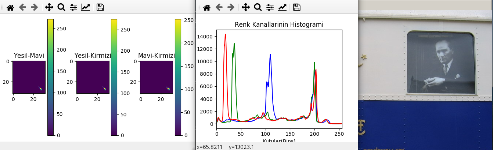
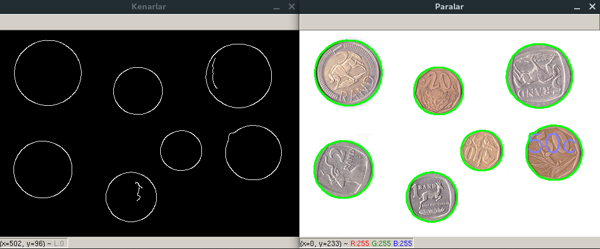
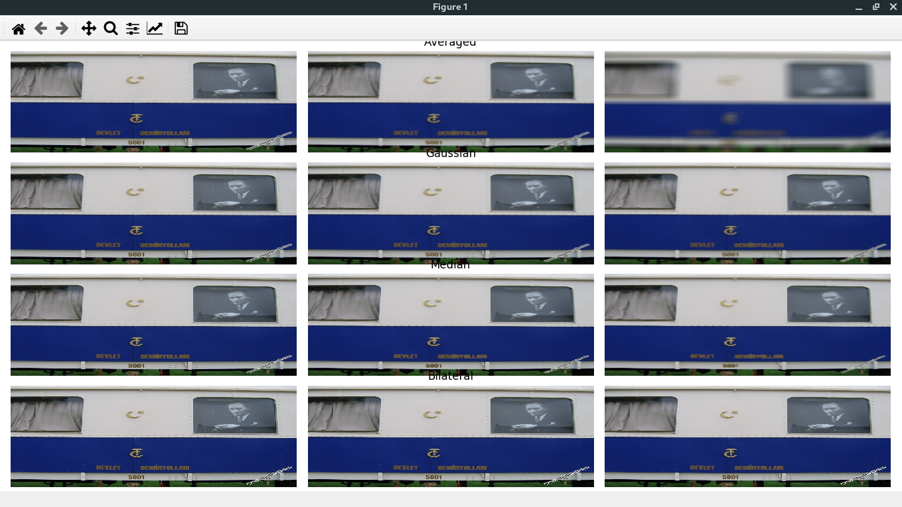
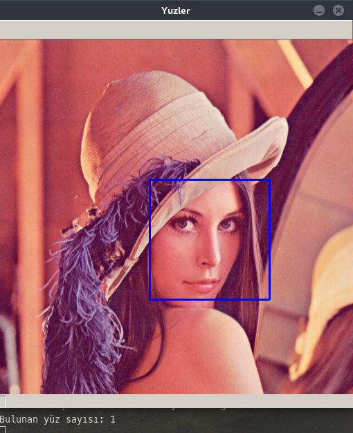
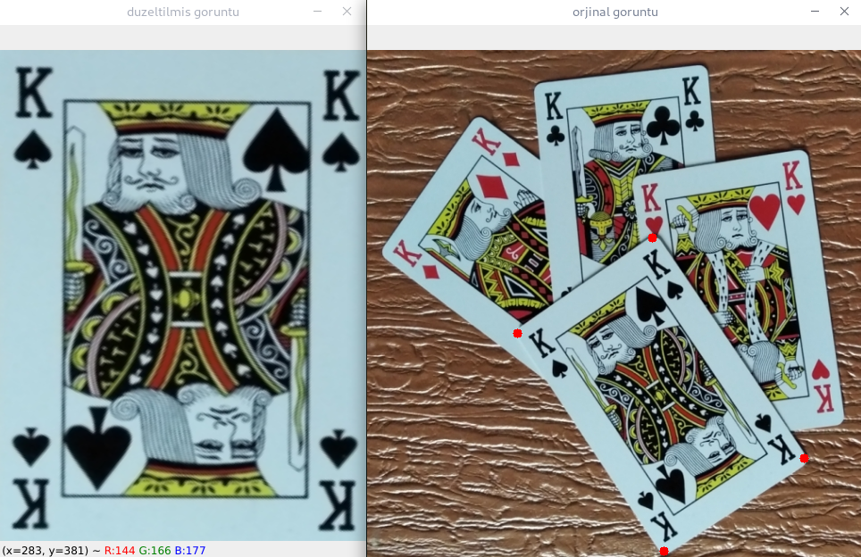
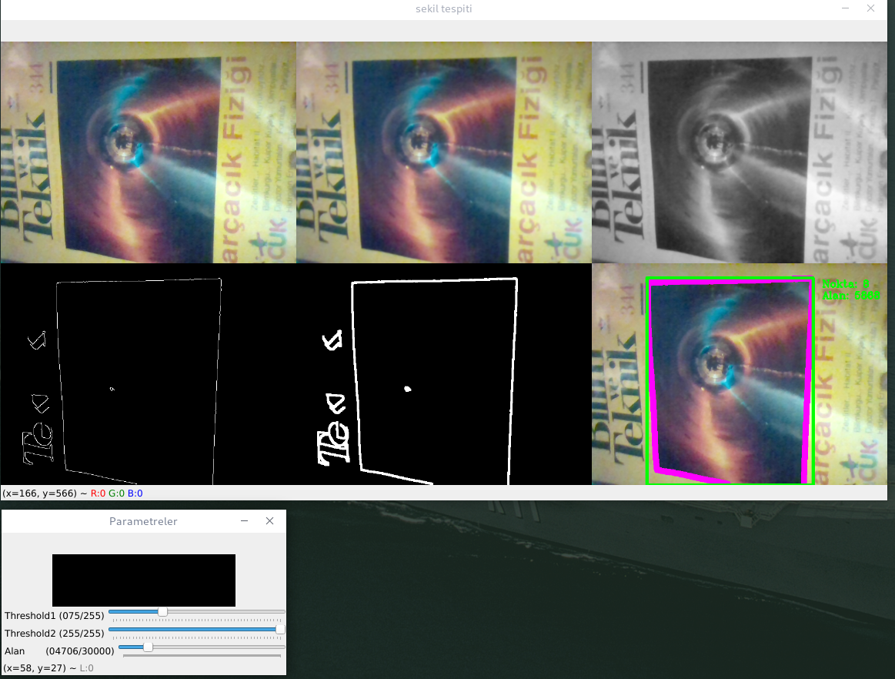

## Python OpenCV Examples



### -

### -

### -

### -

### -

### -



### Installing


Clone the repository:

```sh
git clone https://github.com/emrekndl/opencvPython.git
```

CD in to the directory:

```sh
cd opencvPython
```

Install dependencies:

```sh
pip install -r requirements.txt
```

[](http://hits.dwyl.com/emrekndl/opencvPython)


